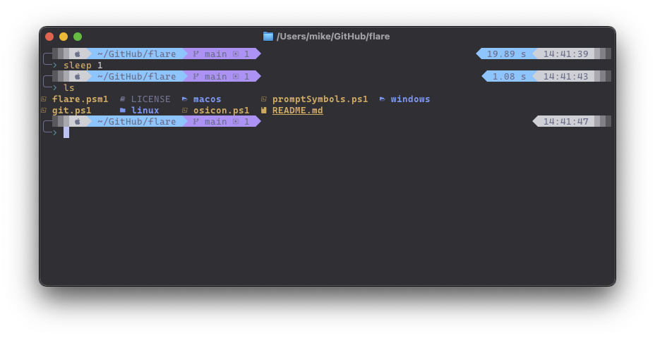

# Flare Prompt

🚀 **The Best Natively Written PowerShell Prompt** 🚀

A high-performance, feature-rich PowerShell prompt inspired by [tide](https://github.com/IlanCosman/tide) and [powerlevel10k](https://github.com/romkatv/powerlevel10k), built entirely with native PowerShell for maximum compatibility and performance.



## ✨ Features

### 🎯 **Performance Optimized**
- **Asynchronous Background Jobs**: Slow operations run in background threads without blocking your prompt
- **Intelligent Caching**: Results are cached with configurable TTL to avoid redundant operations
- **Debounced Redraws**: Prevents excessive prompt updates during rapid operations
- **Native PowerShell**: No external dependencies or complex compilation required

### 🛠 **Development Environment Support**
- **Git Integration**: Comprehensive git status with branch, ahead/behind, stashes, and operation indicators
- **Node.js**: Detects package.json, shows version and package manager (npm/yarn)
- **Python**: Virtual environment detection (venv, conda, poetry, pipenv) with version display
- **Rust, Go, Java, Zig, Bun**: Automatic detection and version display
- **Path Intelligence**: Smart path shortening with home directory substitution

### 🎨 **Visual Excellence**
- **Dynamic Colors**: Adaptive color schemes based on terminal capabilities
- **Status Indicators**: Visual feedback for command success/failure with enhanced symbols
- **Clean Separators**: Powerline-style separators with customizable symbols
- **Performance Metrics**: Optional rendering time display for optimization

### ⚙️ **Advanced Configuration**
- **Modular Design**: Each prompt piece is independently configurable
- **Runtime Configuration**: Change settings without reloading the module
- **Cache Management**: Manual cache clearing and performance monitoring
- **Error Resilience**: Graceful fallbacks for all operations

## 🚀 Quick Start

```powershell
# Import the module
Import-Module ./flare.psm1

# Your prompt is now enhanced!
```

## 📊 Performance

Flare is designed for speed:

- **Main Thread Pieces**: Instant display for critical information (pwd, date, etc.)
- **Background Processing**: Heavy operations (git status, language versions) run asynchronously
- **Smart Caching**: Frequently accessed data is cached with automatic invalidation
- **Optimized Git**: Batch git operations and intelligent repository detection

Typical render times:
- Fast pieces: < 1ms
- Cached operations: < 5ms  
- Fresh git status: ~30ms (background)
- Overall prompt: < 10ms

## 🎛 Configuration

### Basic Customization

```powershell
# Configure prompt symbols before importing
$global:flare_promptSeparatorsLeft = ""
$global:flare_promptHeadLeft = ""
$global:flare_promptTailLeft = "░▒▓"
$global:flare_promptSeparatorsRight = ""
$global:flare_promptHeadRight = ""
$global:flare_promptTailRight = "▓▒░"
$global:flare_topPrefix = "╭─"
$global:flare_bottomPrefix = "╰─"
$global:flare_promptArrow = ""
```

### Advanced Configuration

```powershell
# Configure performance and behavior
Set-FlareConfiguration @{
    EnablePerformanceMonitoring = $true
    MaxCacheAge = [TimeSpan]::FromMinutes(5)
    DebounceIntervalMs = 50
    ShowPerformanceMetrics = $false
}

# Get current configuration
$config = Get-FlareConfiguration

# View performance statistics
Get-FlareStatistics

# Clear caches manually
Reset-FlareCache
```

### Customize Prompt Pieces

```powershell
# Configure which pieces appear on left and right
$global:flare_leftPieces = @('os', 'pwd', 'git')
$global:flare_rightPieces = @('date', 'node', 'python', 'lastCommand')

# Configure icons for each piece
$global:flare_icons_git = ""
$global:flare_icons_node = "󰎙"
$global:flare_icons_python = ""
```

## 🔧 Testing & Validation

```powershell
# Test individual piece performance
./testPiecesTiming.ps1

# Test git functionality across different states
./testGitStates.ps1

# Debug specific piece timing
./debugPieceTiming.ps1
```

## 🏗 Architecture

### Core Components

- **`flare.psm1`**: Main module with async job management and caching
- **`pieces/`**: Individual prompt components (git, node, python, etc.)
- **`utils/`**: Shared utilities for file operations and piece invocation
- **`promptSymbols.ps1`**: Symbol and configuration definitions

### Design Principles

1. **Async-First**: Heavy operations never block the main thread
2. **Cache-Aware**: Intelligent caching prevents redundant work
3. **Error-Resilient**: Graceful degradation when tools aren't available
4. **PowerShell-Native**: Uses PowerShell idioms and best practices
5. **Performance-Focused**: Every operation is optimized for speed

## 🎯 Git Integration

Advanced git status with comprehensive information:

- **Branch/Tag/Commit**: Current location with smart detection
- **Operations**: Rebase, merge, cherry-pick status with progress
- **Changes**: Staged, unstaged, untracked, and conflicted files
- **Remote**: Behind/ahead indicators with counts
- **Stashes**: Stash count display
- **Performance**: Cached repository detection and batch operations

Symbols used:
- `⇣` Behind commits
- `⇡` Ahead commits  
- `⚑` Stashes
- `✖` Conflicts
- `●` Staged changes
- `✚` Unstaged changes
- `…` Untracked files

## 🐍 Python Environment Detection

Comprehensive Python environment support:

- **Virtual Environments**: venv, .venv, virtualenv
- **Conda**: Environment name display
- **Poetry**: Automatic detection and naming
- **Pipenv**: Environment indicator
- **Pyenv**: Version-specific environments
- **Project Detection**: Automatic activation based on project files

## 📁 Intelligent Path Display

Smart path shortening strategies:

- **Home Substitution**: `~` for home directory
- **Length Optimization**: Shortens intermediate directories
- **Context Preservation**: Keeps important path components
- **Cross-Platform**: Works on Windows, macOS, and Linux

## 🚀 Performance Monitoring

Built-in performance monitoring:

```powershell
# Enable performance tracking
Set-FlareConfiguration @{ EnablePerformanceMonitoring = $true }

# View detailed statistics
Get-FlareStatistics
# Returns:
# @{
#     TotalRenders = 1250
#     AverageRenderTime = 8.5
#     LastRenderTime = 12.3
#     CachedItems = 15
#     ActiveBackgroundJobs = 1
# }
```

## 🛠 Development & Contributions

### Code Style Guidelines

- **Functions**: PascalCase (`Get-PromptLine`, `Start-PieceJob`)
- **Variables**: camelCase (`$promptColor`, `$gitDir`)
- **Globals**: Prefix with `global:flare_` (`$global:flare_promptState`)
- **Error Handling**: Use `-ErrorAction SilentlyContinue` and return empty strings
- **Performance**: Async background jobs for slow operations
- **Testing**: All pieces must pass timing and functionality tests

### Architecture Notes

- **Main Thread**: Fast operations only (< 10ms)
- **Background Jobs**: Heavy operations (git, package managers)
- **Caching**: Intelligent invalidation based on context changes
- **Error Handling**: Graceful degradation with fallback displays

## 📜 License

[License details here]

---

**Flare**: Where performance meets functionality in PowerShell prompts! 🎯
