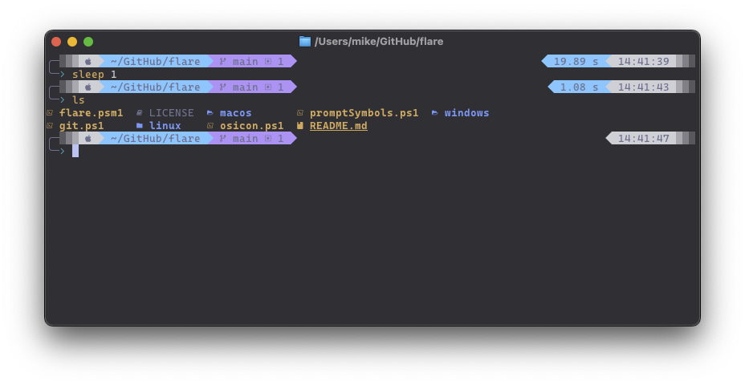

# Flare Prompt

A work in progress.

A powershell native prompt designed to mimic the look and _someday_ feel of [tide](https://github.com/IlanCosman/tide) and/or [powerlevel10k](https://github.com/romkatv/powerlevel10k).

Very little exists here at the moment, and development may be slower as I use Windows less and less.



Currently, it uses base16 colors that it inherits from your terminal.

## Prompt Refresh

Flare renders cheap pieces and available `*_fast` variants synchronously. Slow pieces are evaluated by one long-lived, in-process PowerShell runspace so prompt rendering never waits for them.

The worker performs one refresh at a time and retains only the newest pending request. Results are matched to both a request ID and working directory before they can update the prompt. While a refresh is pending, Flare keeps compatible last-known slow data and overlays fresh fast data. A changed result redraws the prompt when PowerShell is idle.

Slow refreshes do not have a timeout. A hung refresh delays later slow updates, but the prompt remains responsive and does not create additional workers.

Module removal and shell exit request asynchronous worker shutdown, so teardown never waits for an active slow piece.

## Customization

### Separators, Heads, and Tails

Right now, before loading flare, you can customize the prompt separators, the defaults are below:

```pwsh
$global:flare_promptSeparatorsLeft ??= ""
$global:flare_promptHeadLeft ??= ""
$global:flare_promptTailLeft ??= "░▒▓"
$global:flare_promptSeparatorsRight ??= ""
$global:flare_promptHeadRight ??= ""
$global:flare_promptTailRight ??= "▓▒░"
$global:flare_gitIcon ??= ""
$global:flare_topPrefix ??= "╭─"
$global:flare_bottomPrefix ??= "╰─"
$global:flare_promptArrow ??= ""
```

You can set the pieces to different symbols/characters/strings.
